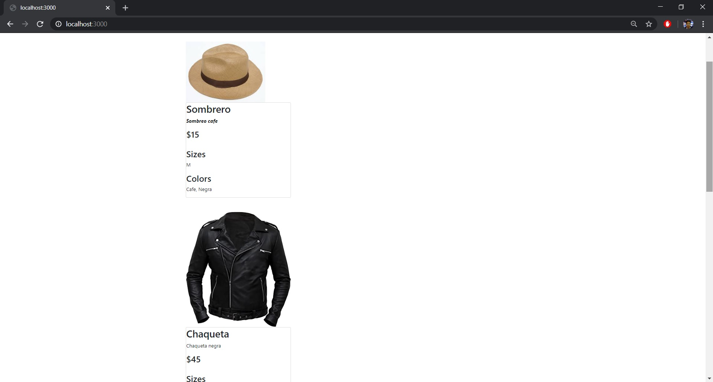

# KeyStoneJs CMS
Este proyecto constituye un ejemplo del framework KeyStone JS para crear un CMS sencillo con **Node JS**, **React JS**, **Next JS** y **Mongo DB**, simulando una tienda de ropa. Para la realización de este proyecto se ha usado de referencia el post  - [Build a React-driven blog with Next.js and KeystoneJS](https://medium.com/@victor36max/how-to-build-a-react-driven-blog-with-next-js-and-keystonejs-cae3cd9fb804)

  

---

## ¿Cómo ejecutarlo?

Primero hay que instalar las dependencias

> npm install  

o puede ser tambien

> yarn install 

Es importante tener una version de Node.js >= 10.x

> node --version

Para poder ejecutar la aplicación 

> node keystone

El proyecto se ejecutar sobre 

http://localhost:3000/

## ¿Cómo acceder?

http://localhost:3000/keystone

Credenciales Administrador

correo: admin@correo.com
passwd: admin1234

Para agregar o quitar productos lo puede hacer desde **Products**